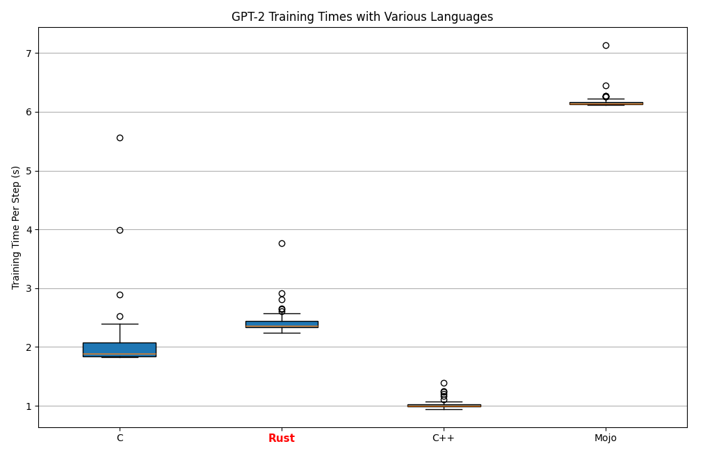

# llm.rs

Migration of Karpathy's [llm.c](https://github.com/karpathy/llm.c) project into Rust

## Development Process

The development steps taken to migrate llm.c into Rust

### 1. Utilizing [c2rust](https://github.com/immunant)

Using c2rust, train_gpt2.c was translated from Karpathy's [llm.c](https://github.com/karpathy/llm.c) project to Rust.

### 2. Utilizing [GPT4](https://chat.openai.com)

Although the transpilation of c2rust was successful, all the for loops have been turned into while loops.

Using GPT-4, we are able to convert all the while loops back into for loops.

### 3. Utilizing [Mate](https://github.com/trusted-programming/mate)

Furthermore, using Mate, we converted some of these for loops into iter() functions using the Rayon library.

### 4. Manual Updates

Currently, the project is undergoing manual updates to find performance improvements

## Performance

Currently this implementation is still slower than the C version based on the following benchmarks:
|                               | C      | Rust   |C++     | Mojo   |
|-------------------------------|--------|--------|--------|--------|
| Intel Core i7-9700 8-core     | 2.447s | 2.530s |        |        |
| Intel Xeon E5-2690 v3 12-core | 2.110s | 2.439s | 1.037s | 6.190s |



## Quick Start

Install python dependencies, output tokenized dataset, and load in the weights:

```bash
make setup
```

Run the training script:

```bash
make train
```

This will run `cargo build --release` from the llm-rs cargo project after which the binary will be copied into the main project folder.

## TODO

- [X] Fix types to remove unnecessary casts
- [X] Restructure the training script for improved readability
- [X] Implement the latest version of the tokenizer
- [X] Implement the latest version of the data loader
- [ ] Improve speed to match the performance of the C implementation 
- [ ] Migrate the testing script
- [ ] Fix tinystories dataset download
